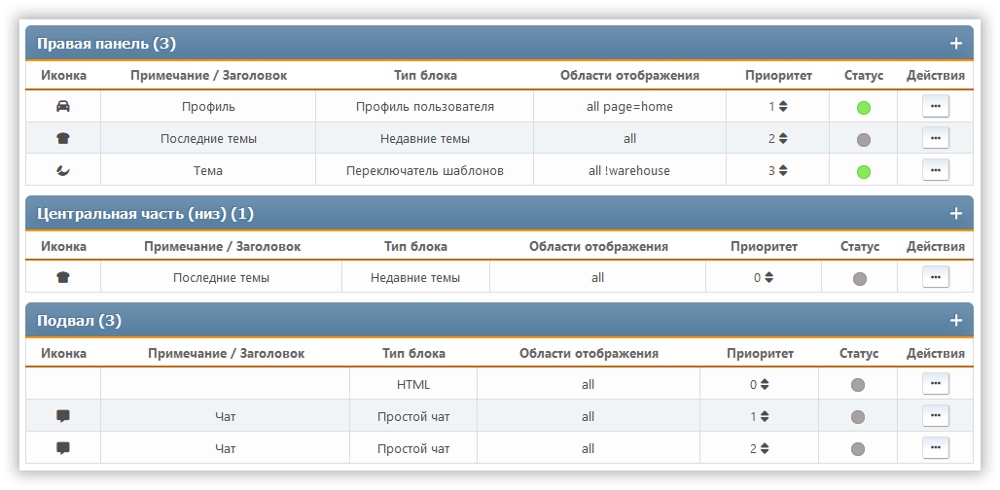

# Управление блоками

Этот раздел показывает все блоки портала, которые настроены, независимо от того, включены они или отключены. Блоки отсортированы по панелям.

Для каждого блока мы видим его иконку, описание или заголовок, тип, куда направляется вывод, насколько он важен, и список действий, которые с ним можно выполнить.

Для каждого блока доступны следующие действия:

- Изменение приоритета — внутри каждой панели можно настроить индивидуальный порядок блоков
- Переключение статуса (включен или отключен)
- Клонирование — создание нового блока, копирующего текущий
- Правка — изменение настроек конкретного блока
- Удаление
