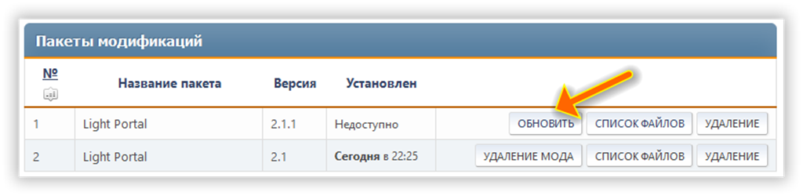

# Обновление

Если в списке изменений нет конкретных инструкций по обновлению до последней версии, вы можете выполнять обновление, извлекая каталоги `Themes` и `Sources` в корневой каталог вашего форума и перезаписывая существующие файлы.

Однако для правильной установки мы рекомендуем сначала удалить текущую версию.

:::info Примечание

Если новую версию можно установить, не удаляя предыдущую, то вместо кнопки «Установить» появится кнопка «Обновить»:

:::
