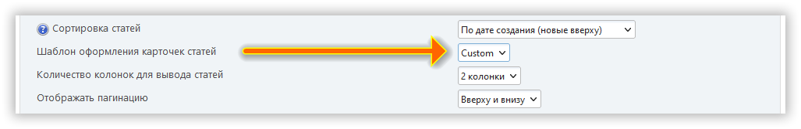

# Создание макета главной страницы

:::info

Начиная с версии 2.2.0 мы используем [Latte](https://latte.nette.org/syntax) для рендеринга макетов главной страницы.

:::

В дополнение к уже имеющимся макетам всегда можно добавить собственные.

Для этого создайте файл `custom.latte` в директории `/Themes/default/portal_layouts`:

```php:line-numbers {9}
{varType array $txt}
{varType array $context}
{varType array $modSettings}

{if empty($context[lp_active_blocks])}
<div class="col-xs">
{/if}

    <div class="lp_frontpage_articles article_custom">
        {do show_pagination()}

            <div
                n:foreach="$context[lp_frontpage_articles] as $article"
                class="col-xs-12 col-sm-6 col-md-4 col-lg-{$context[lp_frontpage_num_columns]}"
            >
                <div n:if="!empty($article[image])">
                    
                </div>
                <h3>
                    <a href="{$article[msg_link]}">{$article[title]}</a>
                </h3>
                <p n:if="!empty($article[teaser])">
                    {teaser($article[teaser])}
                </p>
            </div>

        {do show_pagination(bottom)}
    </div>

{if empty($context[lp_active_blocks])}
</div>
{/if}
```

После этого в настройках портала появится макет главной страницы под названием `Custom`:



Вы можете создать столько макетов, сколько захотите. Используйте `debug.latte` и другие макеты в директории `/Themes/default/LightPortal/layouts` в качестве примеров.

Для кастомизации таблиц стилей создайте файл `portal_custom.css` в директории `/Themes/default/css`:

```css {3}
/* Ваш макет */
.article_custom {
  /* Ваши правила */
}
```

:::tip

Если вы создали свой шаблон главной страницы и хотите поделиться им с разработчиком и другими пользователями, воспользуйтесь https\://codepen.io/pen/ или другими подобными ресурсами.

:::
