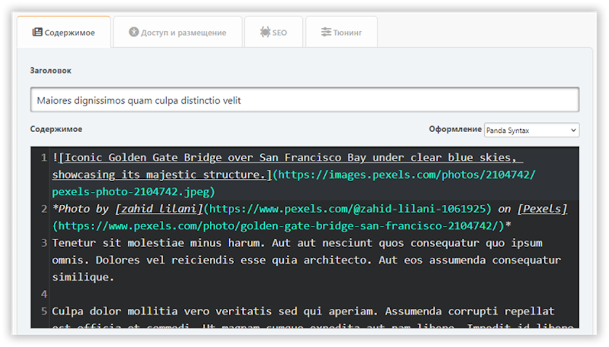
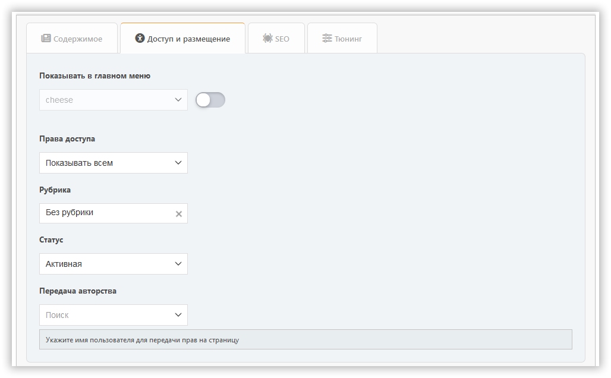
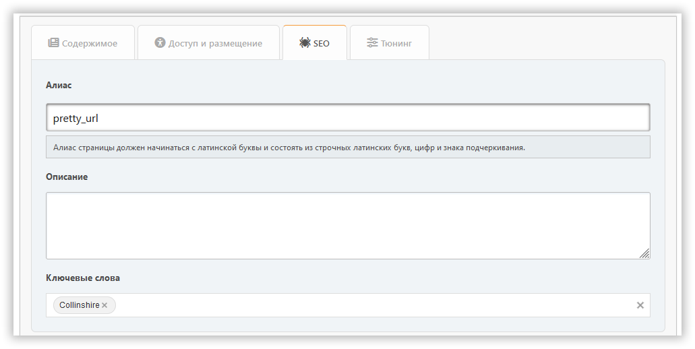
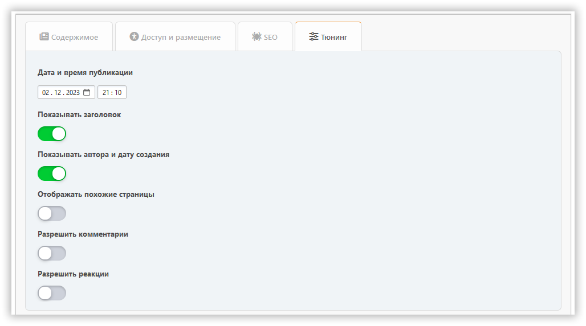

# Добавление страницы

В этом разделе можно создать страницу портала с нужным вам содержанием. Обязательные для заполнения поля подсвечиваются цветной рамочкой.

## Вкладка «Контент»

Здесь можно настроить:

- заголовок
- тип страницы
- содержимое

## Вкладка «Доступ и размещение»

Здесь можно настроить:

- права доступа — укажите, кому будет доступна ваша страница
- категорию — если вы любите всё упорядочивать по полочкам
- передача авторства — если хотите изменить автора

## Вкладка «SEO»

Здесь можно настроить:

- слаг— часть URL-адреса страницы (`?page=slug`)
- описание — meta description
- теги — будут отображаться как теги страницы и ключевые слова

## Вкладка «Тюнинг»

Здесь можно настроить:

- дату и время публикации — страница может быть опубликована по расписанию
- отображение заголовка — можно отключить, если у вас собственный заголовок на странице
- отображение автора и даты создания
- отображение похожих страниц
- комментарии — их можно разрешить или запретить отдельно для каждой страницы

