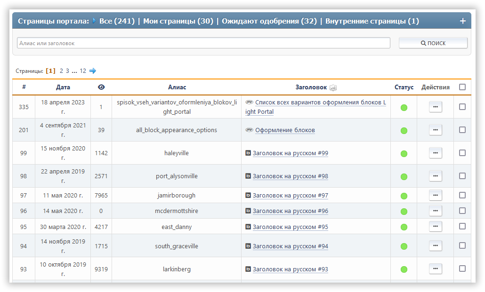

# Управление страницами

В этом разделе перечислены все созданные страницы портала, доступные для редактирования текущему пользователю. Есть поиск страниц по заголовку или слагу.

Для каждой страницы отображаются её идентификатор, дата создания/обновления, количество просмотров, количество комментариев, тип, слаг, заголовок и список действий.

Для каждой страницы доступны следующие действия:

- Переключение статуса (включен или отключен)
- Правка — изменение выбранной страницы
- Удаление

Также доступны массовые действия со страницами.
