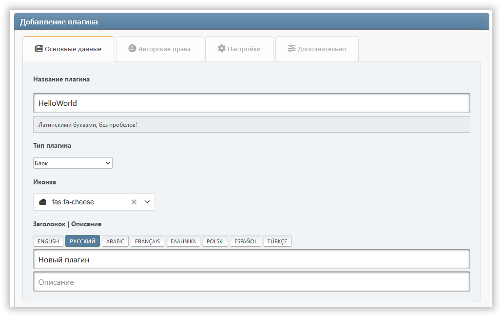

# Создание плагина

Плагины — дополнения, расширяющие возможности портала. Чтобы создать собственный плагин для Light Portal, достаточно следовать инструкциям ниже.

:::info Примечание

Вы можете использовать **PluginMaker** в качестве помощника при создании своих плагинов. Скачайте и подключите его на странице _Админка -> Настройки портала -> Плагины_.



:::

## Выбор типа плагина

На данный момент в Light Portal доступны следующие типы дополнений:

| Тип                             |                                                                                                                            Описание |
| ------------------------------- | ----------------------------------------------------------------------------------------------------------------------------------: |
| `block`                         |                                                                  Плагины, добавляющие новый вид блоков для портала. |
| `ssi`                           |                     Плагины (как правило, блоки), использующие SSI-функции для получения данных. |
| `editor`                        |                                                  Плагины, добавляющие сторонний редактор для разных типов контента. |
| `comment`                       |                                            Плагины, добавляющие сторонний виджет комментариев, вместо стандартного. |
| `parser`                        |                                                              Плагины, реализующие парсер контента страниц и блоков. |
| `article`                       |                                                       Плагины для обработки содержимого карточек статей на главной. |
| `frontpage`                     |                                                                     Плагины для изменения главной страницы портала. |
| `impex`                         |                                                         Плагины для импорта и экспорта различных элементов портала. |
| `block_options`, `page_options` | Плагины, добавляющие дополнительные параметры для соответствующей сущности (блока или страницы). |
| `icons`                         | Плагины, добавляющие новые библиотеки иконок для замены элементов интерфейса или использования в заголовках блоков. |
| `seo`                           |                                                  Плагины, тем или иным образом влияющие на видимость форума в сети. |
| `other`                         |                                                                   Плагины, не входящие ни в одну из категорий выше. |

## Создание директории плагина

Создайте отдельную папку для файлов вашего дополнения, внутри `/Sources/LightPortal/Plugins` Например, если ваш плагин называется `HelloWorld`, структура папки должна выглядеть так:

```
...(Plugins)
└── HelloWorld/
    ├── langs/
    │   ├── english.php
    │   └── index.php
    ├── index.php
    └── HelloWorld.php
```

Файл `index.php` можно скопировать из папок других дополнений. файле `HelloWorld.php` содержится логика плагина:

```php:line-numbers {17}
<?php declare(strict_types=1);

namespace Bugo\LightPortal\Plugins\HelloWorld;

use Bugo\Compat\{Config, Lang, Utils};
use Bugo\LightPortal\Plugins\Plugin;

if (! defined('LP_NAME'))
    die('No direct access...');

class HelloWorld extends Plugin
{
    // FA icon (for blocks only)
    public string $icon = 'fas fa-globe';

    // Your plugin's type
    public string $type = 'other';

    // Optional init method
    public function init(): void
    {
        echo 'Hello world!';
    }

    // Hookable and custom methods
}

```

## Использование SSI

Если в плагине требуется получить какие-либо данные с помощью SSI-функций, используйте метод `getFromSsi(string $function, ...$params)`. В качестве параметра `$function` нужно передать имя одной из функций, находящихся в файле **SSI.php**, без приставки `ssi_`. Например:

```php
$data = $this->getFromSSI('topTopics', 'views', 10, 'array');
```

## Использование Composer

Ваш плагин может использовать сторонние библиотеки, устанавливающиеся через Composer. Убедитесь, что в директории плагина расположен файл `composer.json`, в котором указаны необходимые зависимости. Перед публикацией вашего плагина откройте директорию плагина в командной строке и выполните команду: `composer install --no-dev -o`. После этого всё содержимое директории плагина можно упаковать как отдельную модификацию для SMF (для примера см. пакет **PluginMaker**).
