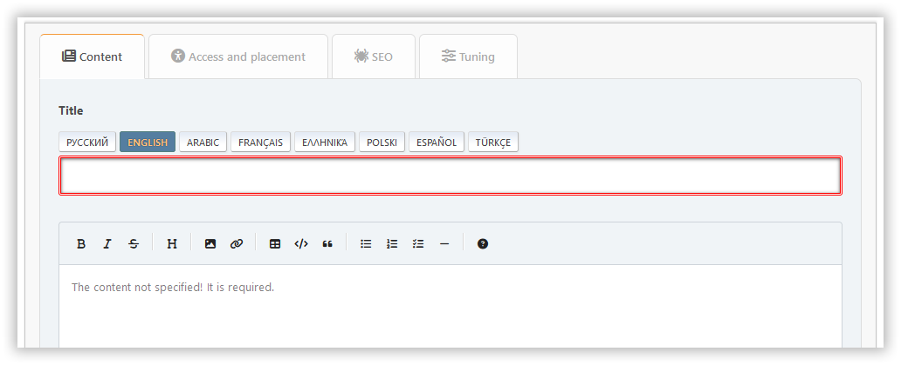
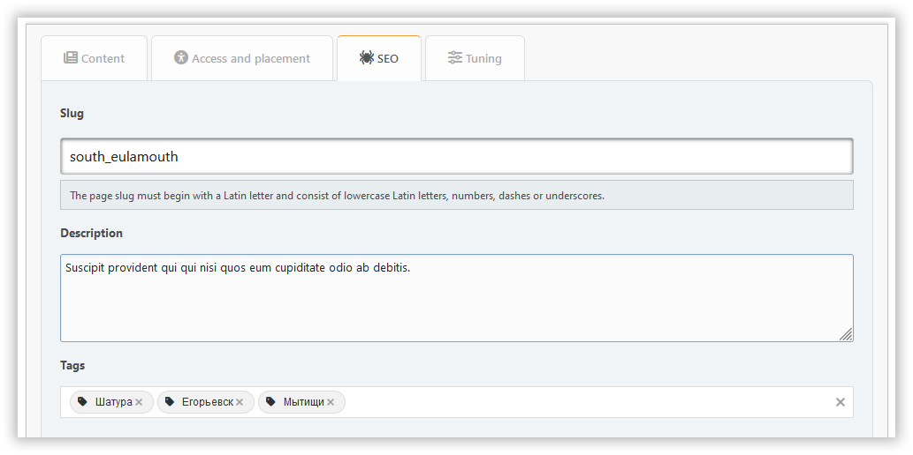

# Dodaj stran

V tem razdelku lahko ustvariš portalno stran s potrebnimi vsebinami. Obvezna polja so poudarjena z obrobo v barvi.

## Zavihek za vsebino

Tukaj lahko nastaviš:

- naslov
- vrsta strani
- vsebina

## Zavihek za dostop in postavitev

Tukaj lahko nastaviš:

- dovoljenja — določi, kdo bo imel dostop do tvoje strani
- category — if you like to keep things organized
- prenos avtorstva — če želiš spremeniti avtorja

## Zavihek SEO

Tukaj lahko nastaviš:

- identifikator strani — je del URL-ja strani (?page=identifikator-strani)
- opis — meta opis strani
- oznake — bodo prikazane kot oznake strani in meta ključne besede

## Zavihek za prilagoditve

Tukaj lahko nastaviš:

- datum in čas objave — stran se lahko objavi po urniku
- prikaži naslov — lahko se onemogoči, če imaš na strani svojo glavo
- prikaži avtorja in datum ustvarjanja
- prikaži sorodne strani
- komentarji — lahko jih omogočiš ali onemogočiš za vsako stran posebej

