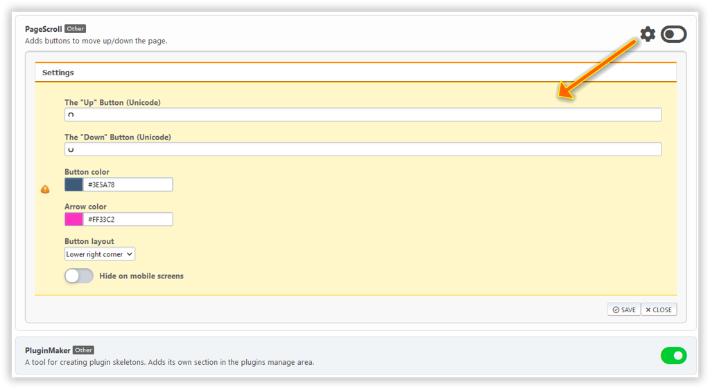

# Upravljanje vtičnikov

Tukaj so našteti vsi nameščeni vtičniki portala. Nekateri vtičniki imajo lastne nastavitve.

Lahko preklopiš med prikazom vtičnikov v eni kolumni (privzeto) ali dveh kolumnah.

Če želiš spremeniti nastavitve vtičnika, klikni na zobnik poleg stikala vtičnika.

## Namestitev dodatnih vtičnikov

Nekateri vtičniki niso vključeni v portal, potrebno jih je namestiti ločeno. Taki vtičniki so razdeljeni na prenosljive in pa bonus vtičnike, ki so na voljo sponzorjem projekta.

Ločen paket vtičnika je mogoče namestiti v razdelku Plugin Import. Lahko pa tudi preprosto izvlečeš mapo vtičnika iz prenesenega arhiva in jo premakneš v mapo `Sources/LightPortal/Plugins`.
