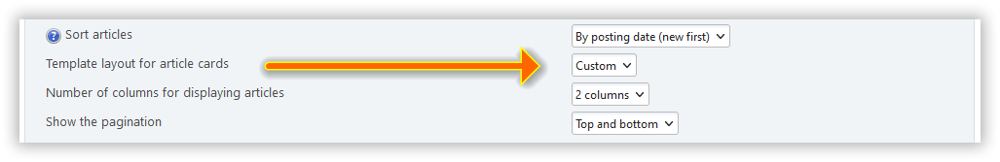

# Kendi ana sayfa düzeninizi oluşturun

:::info Not

2.6 sürümünden itibaren, ana sayfa düzenlerini oluşturmak için [BladeOne](https://github.com/EFTEC/BladeOne) kullanıyoruz.

:::

Mevcut düzenlere ek olarak, her zaman kendi düzeninizi ekleyebilirsiniz.

Bunu yapmak için, `/Themes/default/portal_layouts` dizininde `custom.blade.php` adlı bir dosya oluşturun:

```php:line-numbers {9}
@empty ($context['lp_active_blocks'])
<div class="col-xs">
@endempty
	<!-- <div> @dump($context['user']) </div> -->

	<div class="lp_frontpage_articles article_custom">
		{{ show_pagination() }}

		@foreach ($context['lp_frontpage_articles'] as $article)
		<div class="
			col-xs-12 col-sm-6 col-md-4
			col-lg-{{ $context['lp_frontpage_num_columns'] }}
			col-xl-{{ $context['lp_frontpage_num_columns'] }}
		">
			<figure class="noticebox">
				{!! parse_bbc('[code]' . print_r($article, true) . '[/code]') !!}
			</figure>
		</div>
		@endforeach

		{{ show_pagination('bottom') }}
	</div>

@empty ($context['lp_active_blocks'])
</div>
@endempty
```

Bundan sonra, portal ayarlarında yeni bir ana sayfa düzeni - `Custom` - göreceksiniz:



İstediğiniz kadar böyle düzen oluşturabilirsiniz. `/Themes/default/LightPortal/layouts` dizinindeki `debug.blade.php` ve diğer düzenleri örnek olarak kullanın.

Stil sayfalarını özelleştirmek için, `/Themes/default/css` dizininde `portal_custom.css` adlı bir dosya oluşturun:

```css {3}
/* Custom layout */
.article_custom {
  /* Your rules */
}
```

:::tip Tavsiye

Kendi ana sayfa şablonunuzu oluşturduysanız ve bunu geliştirici ve diğer kullanıcılarla paylaşmak istiyorsanız, https://codepen.io/pen/ veya diğer benzer kaynakları kullanın.

:::
