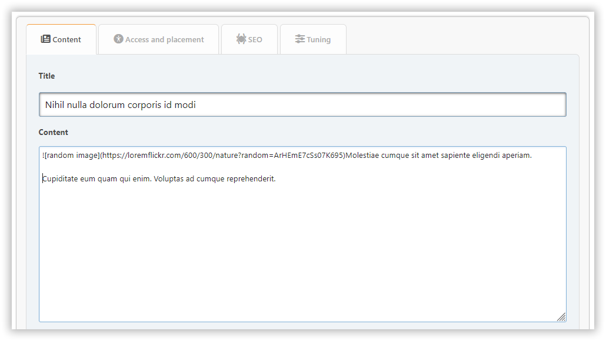

# Sayfa ekle

Bu bölümde, ihtiyaç duyduğunuz içerikle bir portal sayfası oluşturabilirsiniz.

## Sayfa türleri

### Yerleşik içerik türleri

- **BBC**: İçerikte BBCode işaretlemelerine izin verir
- **HTML**: İşlenmemiş HTML içeriği
- **PHP**: Çalıştırılabilir PHP kodu (sadece admin)

### Eklenti-tabanlı bloklar

Eklentiler yeni sayfa türleri ve durumlar ekleyerek işlevselliği genişletebilir. Örnekler:

- **Markdown**: İçerik için Markdown sözdizimini etkinleştirir
- **BlogMode**: Sayfaları ayrı bir menü bölümünde göstermek için yeni bir "Blok girdisi" ekler

## İçerik sekmesi

Burada şunları yapılandırabilirsiniz:

- başlık
- içerik

## Erişim ve yerleştirme sekmesi

Burada şunları yapılandırabilirsiniz:

- durum — etkin değil, etkin veya onaylanmamış
- izinler — sayfanıza kimin erişeceğini belirtin
- kategori — işleri düzenli tutmak istiyorsanız
- tür — varsayılan, dahili veya taslak

## SEO sekmesi

Burada şunları yapılandırabilirsiniz:

- slug — sayfa URL'sinin bir parçasıdır (`?page=slug`)
- açıklama — meta açıklama
- etiketler — sayfa etiketleri ve meta anahtar kelimeler olarak görüntülenecektir

## Ayar sekmesi

Burada şunları yapılandırabilirsiniz:

- yayın tarihi ve saati — sayfa, bir takvime göre yayınlanabilir
- başlığı göster — sayfada kendi başlığınız varsa devre dışı bırakılabilir
- yazar ve oluşturulma tarihini göster
- ilgili sayfaları göster
- yorumlar — her sayfa için ayrı olarak izin verebilir veya reddedebilirsiniz

