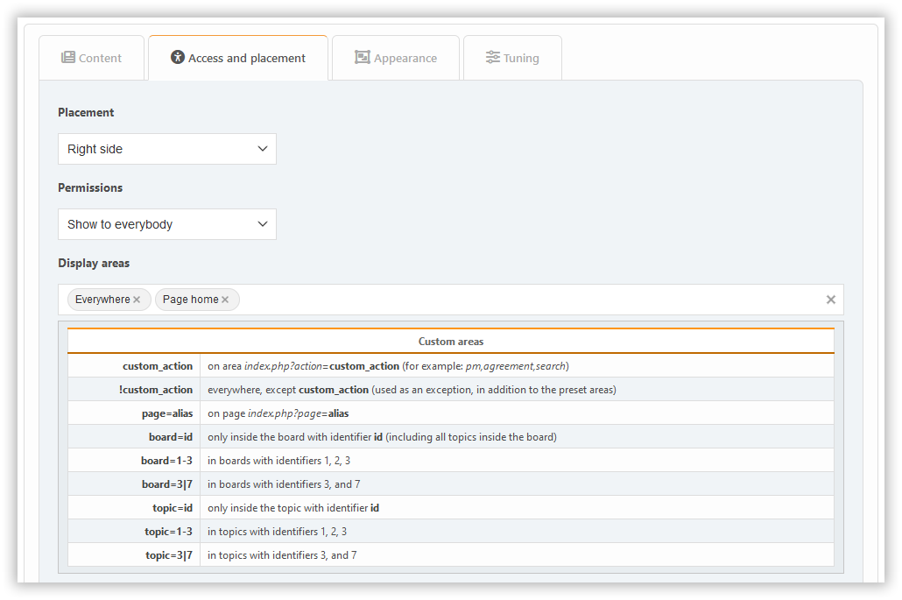

# Додати плагін

Щоб додати блок, просто натисніть на нього. Спочатку ви можете створювати блоки трьох типів: PHP, HTML та BBCode. Якщо вам потрібні інші, спочатку [увімкніть необхідні плагіни](../plugins/manage) типу `block`.

В залежності від типу блоку, будуть доступні різні параметри, поширюються на різні вкладки.

## Вкладка "Вміст"

Тут ви можете налаштувати:

- заголовок
- примітка
- вміст (тільки для деяких блоків)

## Вкладка доступу і розміщення

Тут ви можете налаштувати:

- публікація
- дозволи
- ділянки

## Зовнішня вкладка

Тут ви можете налаштувати:

- параметри вигляду

## Вкладка "Настройки"

Тунери для блокування зазвичай доступні на вкладці **Настройки**.

Плагіни можуть додавати власні налаштування у будь-який з цих розділів, в залежності від намірів розробників.
