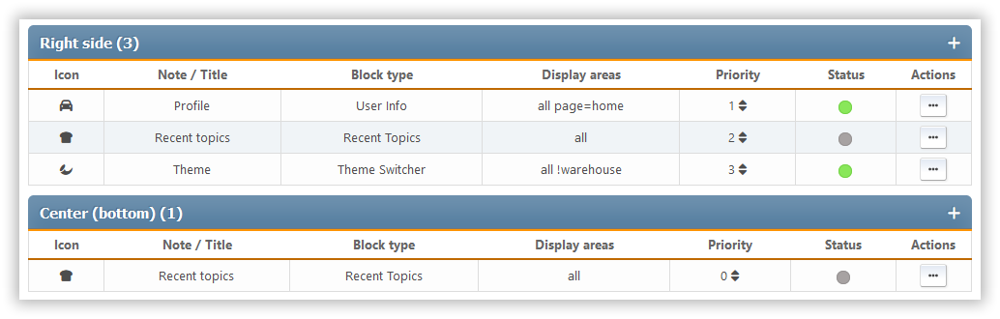

# Керування блоками

This section shows all the portal blocks that are set up, whether they're enabled or disabled. The blocks are sorted by panel.

For each block, we see its icon, title or description, type, output panel, priority, and a list of available actions.

Наступні дії доступні для кожного блоку:

- Зміна пріоритету - всередині кожної панелі можна встановити індивідуальний порядок блоків
- Статус перемикача (увімкнути чи вимкнути)
- Клонувати - створюючи новий блок, який копіює поточний
- Редагування - змінити налаштування певного блоку
- Видалити
