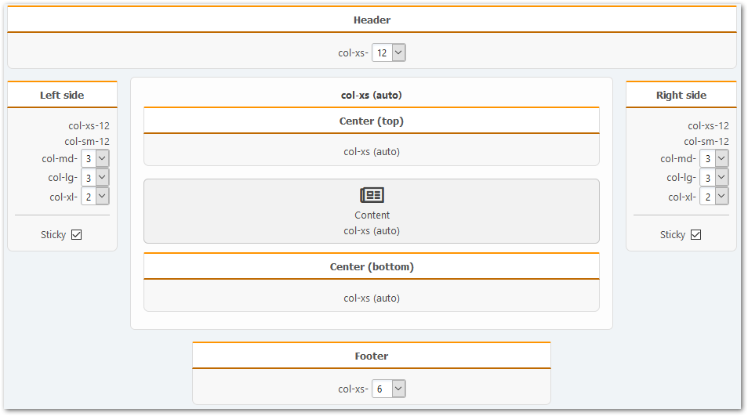

# Налаштування порталу

Використовуйте швидкий доступ через елемент в головному меню форуму або відповідний розділ в панелі адміністратора, щоб відкрити портал.

Кожен з доступних налаштувань не описуватимемо деталі. Ми згадуємо тільки найважливіші.

## Загальні налаштування

In this section, you can fully customize the portal front page, enable standalone mode, and change user permissions to access portal items.

### Settings for the front page and articles

To change the content of the portal home page, select the appropriate "the portal front page" mode:

- Вимкнути
- Вказана сторінка (тільки вибрана сторінка буде показана)
- Всі сторінки з обраних рубрик
- Вибрані сторінки
- Всі теми з обраних розділів
- Вибрані теми
- Вибрані розділи

### Автономний режим

This is a mode where you can specify your own home page, and remove unnecessary items from the main menu (user list, calendar, etc.). Дивись `portal.php` у кореневому каталозі форуму, наприклад.

### Дозволи

Тут ви можете зазначити, що ВООЗ може зробити з різними елементами (блоки й сторінки) порталу.

## Сторінки і блоки

У цьому розділі ви можете змінити основні параметри сторінок і блоків, які використовуються як при їх створенні, так і під час їх відображення.

## Панелі

У цьому розділі можна змінити деякі параметри для вже існуючих портальних панелей і налаштувати напрямок блоків на цих панелях.

## Додатково

У цьому розділі ви можете змінити різні допоміжні налаштування порталу, який може бути корисним для розробників шаблонів і плагінів.

### Режим сумісності

- Значення параметра **дія** порталу - ви можете змінити цей параметр для використання Light Portal у поєднанні з іншими подібними модифікаціями. Потім домашня сторінка відкриється за вказаною адресою.
- Параметр **page** для порталу сторінок - подивіться вище. Similarly, for portal pages - change the parameter and they will open with different URLs.

### Ремонт

- Щотижнева оптимізація таблиць порталу - ввімкнути цю опцію так, щоб раз на тиждень рядки з порожніми значеннями у порталі таблицях в базі даних були видалені, а таблиці будуть оптимізовані.
