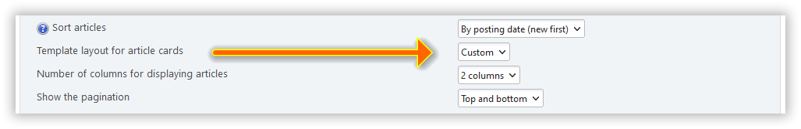

# Create custom layouts

Light Portal uses a flexible template system based on [BladeOne](https://github.com/EFTEC/BladeOne), a standalone implementation of Laravel's Blade templating engine. This system allows you to customize the appearance and structure of your portal through layouts, themes, and reusable components.

## Template system

### Blade templating engine

Blade is a powerful templating engine that provides clean, readable syntax for mixing PHP with HTML. Key features:

- **Template Inheritance**: Use `@extends` and `@section` directives to create layout hierarchies
- **Includes**: Reuse components with `@include` directives
- **Control Structures**: PHP-like syntax with `@if`, `@foreach`, `@while`, etc.

See detailed information about Blade markup [here](https://github.com/EFTEC/BladeOne/wiki/Template-variables).

### Layouts

Layouts define the overall structure of your front page. Located in `/Themes/default/LightPortal/layouts/`, they determine how front page articles are arranged. Examples include:

- `default.blade.php` - Standard grid layout
- `simple.blade.php` - Minimalist design
- `modern.blade.php` - Contemporary styling
- `featured_grid.blade.php` - Highlighted content grid

### Partials

Reusable template components stored in `/Themes/default/LightPortal/layouts/partials/`:

- `base.blade.php` - Main layout wrapper
- `card.blade.php` - Article card template
- `pagination.blade.php` - Page navigation
- `image.blade.php` - Image display component

### Themes and assets

- `/Themes/default/LightPortal`: Portal templates files
- `/languages/LightPortal`: Localization files
- `/css/light_portal`: CSS enhancements
- `/scripts/light_portal`: JavaScript enhancements

## Layout example

In addition to existing front page layouts, you can always add your own.

Щоб зробити це, створіть файл `custom.blade.php` у каталозі `/Themes/default/portal_layouts`:

```php:line-numbers {6,16}
@extends('partials.base')

@section('content')
	<!-- <div> @dump($context['user']) </div> -->

	<div class="lp_frontpage_articles article_custom">
		@include('partials.pagination')

		@foreach ($context['lp_frontpage_articles'] as $article)
			<div class="
				col-xs-12 col-sm-6 col-md-4
				col-lg-{{ $context['lp_frontpage_num_columns'] }}
				col-xl-{{ $context['lp_frontpage_num_columns'] }}
			">
				<figure class="noticebox">
					{!! parse_bbc('[code]' . print_r($article, true) . '[/code]') !!}
				</figure>
			</div>
		@endforeach

		@include('partials.pagination', ['position' => 'bottom'])
	</div>
@endsection

<style>
.article_custom {
	// Your CSS
}
</style>
```

After that you will see a new front page layout - `Custom` - on the portal settings:



Ви можете створити стільки таких макетів, скільки захочете. Використовуйте `debug.blade.php` та інші макети в `/Themes/default/LightPortal/layouts` як приклади.

## CSS customizing

You can easily change the look of anything by adding your own styles. Just create a new file called `portal_custom.css` in the `Themes/default/css` directory and put your CSS there.

:::tip Порада

If you have created your own front page template and want to share it with the developer and other users, use https://codepen.io/pen/ or other similar resources.

:::
