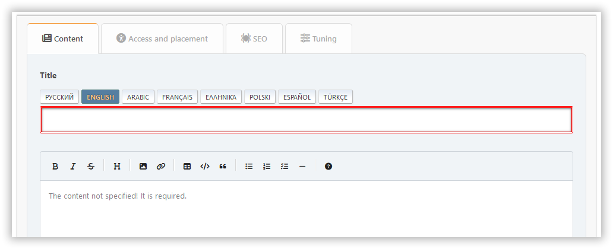
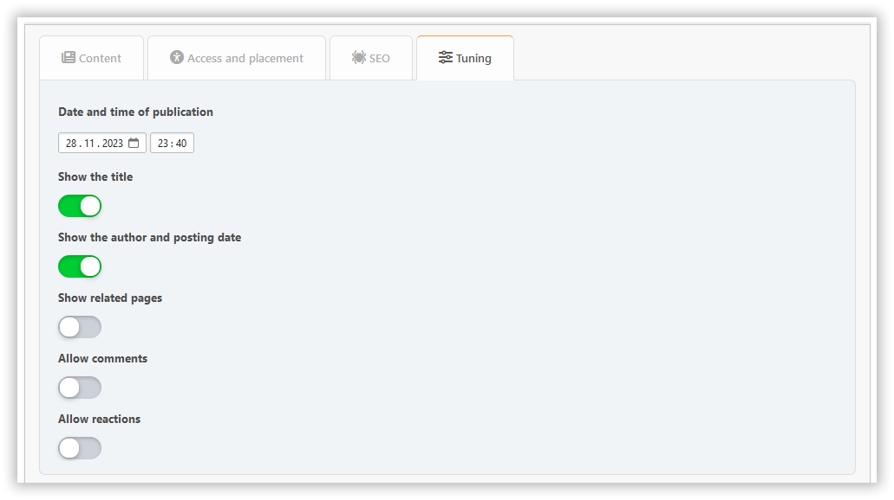

# Додати сторінку

In this section, you can create a portal page with the content you need.

## Page types

### Built-in content types

- **BBC**: Allows BBCode markup for content
- **HTML**: Raw HTML content
- **PHP**: Executable PHP code (admin only)

### Plugin-based pages

Plugins can extend the functionality by adding new page types or statuses. Examples:

- **Markdown**: Enables Markdown syntax for content
- **BlogMode**: Adds a new "Blog entry" type for displaying pages in a separate menu section

## Вкладка "Вміст"

Тут ви можете налаштувати:

- назва
- зміст

## Вкладка доступу і розміщення

Тут ви можете налаштувати:

- status — inactive, active, or unapproved
- права — вкажіть кому буде доступ на сторінку
- категорії - якщо ви любите підтримувати організовані речі
- type — default, internal, or draft

## SEO tab

Тут ви можете налаштувати:

- слаґ - є частиною URL-адреси сторінки (`?page=slug`)
- опис - метаопис
- теги - будуть відображатися як теги сторінок і ключові слова meta

## Вкладка "Настройки"

Тут ви можете налаштувати:

- дата і час публікації — сторінка може бути опублікована за розкладом
- відображення заголовка - можна вимкнути, якщо ви маєте свій власний заголовок на сторінці
- Відображати дату автора і створення
- відображати пов’язані сторінки
- коментарі — ви можете дозволяти або забороняти їх окремо для кожної сторінки

