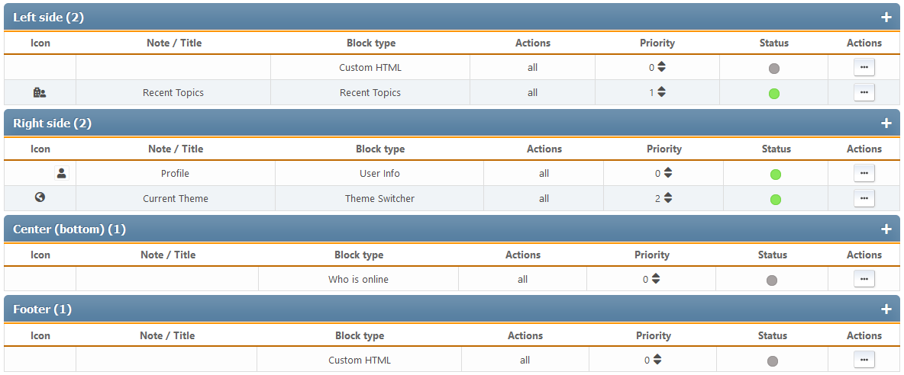

# Manage blocks
This section lists all configured portal blocks, both enabled and disabled. Blocks are sorted by panels.

For each block, its icon, note or title, type, output areas, priority and list of actions are displayed.

The following actions are available for each block:
* Change of priority - inside each panel you can set up an individual order of blocks
* Toggle status (enable or disable)
* Clone - creating a new block that copies the current
* Edit - change the settings of a specific block
* Delete