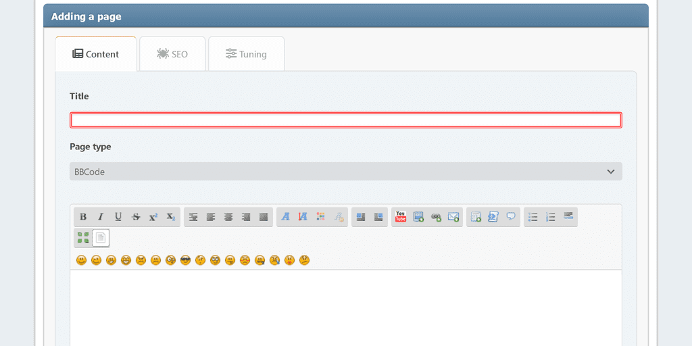

# Add page
In this section, you can create a portal page with the content you need. Required fields are highlighted with a colored frame.

## Content tab
Here you can configure:
* title
* page type
* content

## SEO tab
Here you can configure:
* alias — the page will be available at `?page=alias`
* description — the meta description
* keywords — the meta keywords

## Tuning tab
Here you can configure:
* permissions — specify who will access your page
* category — if you like to keep things organized
* date and time of publication — the page can be published on a schedule
* display the title — can be disabled if you have your own header on the page
* display the author and creation date
* display related pages
* comments — you can allow or deny them separately for each page
