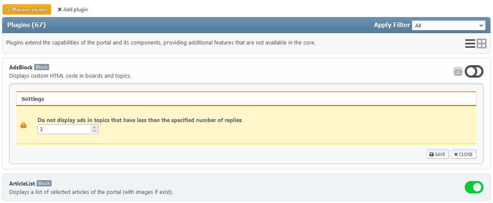

# Manage plugins
All installed portal plugins are listed here. Some of them have their own settings.

You can switch between displaying plugins in 1 column (default) or 2 columns if you wish.

If you want to change the plugin settings, click on the gear next to the plugin toggle button.

