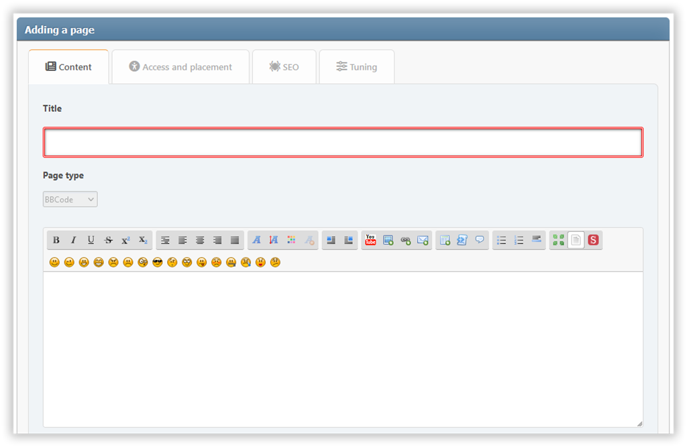

# Přidat stránku
V této sekci můžete vytvořit portál s obsahem, který potřebujete. Požadovaná pole jsou zvýrazněna barevným rámečkem.

## Content tab
Zde můžete nakonfigurovat:
* titulek
* typ stránky
* Obsah

## Přístup a umístění
Zde můžete nakonfigurovat:
* oprávnění – upřesněte, kdo bude přistupovat k vaší stránce
* kategorie — pokud chcete udržet věci organizované
* transfer of authorship — if you want to change the author

## SEO tab
Zde můžete nakonfigurovat:
* alias — stránka bude k dispozici na `?page=alias`
* Popis – meta popis
* klíčová slova – meta klíčová slova

## Tuning tab
Zde můžete nakonfigurovat:
* datum a čas zveřejnění – stránka může být zveřejněna v plánu
* zobrazit název — může být zakázán, pokud máte na stránce vlastní záhlaví
* zobrazit autora a datum vytvoření
* zobrazit související stránky
* komentáře — můžete je povolit nebo odmítnout samostatně pro každou stránku
