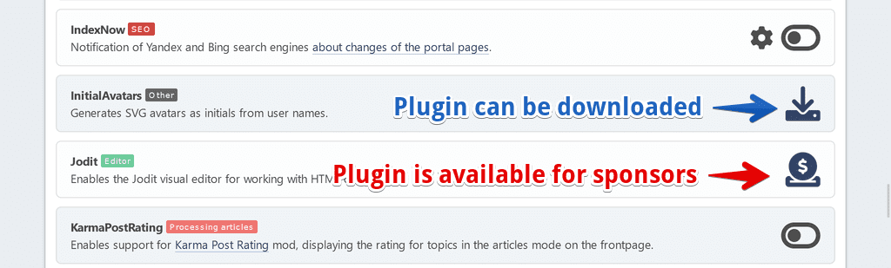

# Spravovat pluginy
Všechny nainstalované portálové pluginy jsou uvedeny zde. Některé z nich mají svá vlastní nastavení.

Můžete přepínat mezi zobrazováním pluginů v 1 sloupci (výchozí) nebo 2 sloupci, pokud chcete.

Pokud chcete změnit nastavení pluginu, klikněte na ozubené kolo vedle tlačítka přepnout zásuvný modul.

## Instalace dalších pluginů
Některé pluginy nejsou zahrnuty do portálu, je třeba je nainstalovat zvlášť. Tyto pluginy jsou rozděleny na stažitelné a bonusové pluginy dostupné sponzorům projektu.

Balíček pluginů lze nainstalovat jako běžnou úpravu prostřednictvím **SMF Package Manager**. Ale můžete také extrahovat složku pluginu ze staženého archivu a přesunout ji do adresáře `Sources/LightPortal/Addons`.
