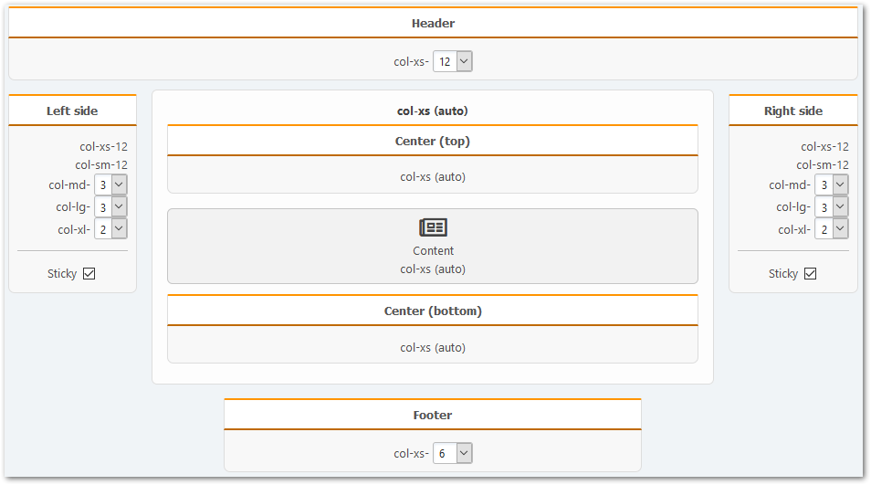

# Portaleinstellungen
Benutzen Sie den Schnellzugriff über den Eintrag im Hauptmenü des Forums oder den entsprechenden Abschnitt im Administrationsbereich, um die Portaleinstellungen zu öffnen.

## Allgemeine Einstellungen
In diesem Abschnitt können Sie die Portal-Hauptseite vollständig personalisieren, den autonomen Modus aktivieren und Benutzerzugriffsberechtigungen auf Portalelemente ändern.

### Einstellungen für die Hauptseite und Artikel

* Die Portal-Hauptseite – wählen Sie aus, was auf der Hauptseite des Portals angezeigt werden soll:
    * Deaktiviert
    * Spezifische Seite (nur die ausgewählte Seite wird angezeigt)
    * Alle Seiten aus ausgewählten Kategorien
    * Ausgewählte Seiten
    * Alle Themen aus ausgewählten Boards
    * Ausgewählte Themen
    * Ausgewählte Boards
* Der Hauptseitentitel – Sie können den Namen des Portals ändern, der als Seitentitel und Titel des Browsertabs verwendet wird.
* In Artikeln gefundene Bilder anzeigen – aktivieren Sie dies, um Bilder anzuzeigen, die im Text von Seiten oder Themen gefunden wurden.
* URL des Standard-Platzhalter-Bildes – falls die obige Option aktiviert ist, aber kein Bild im Text gefunden wird, wird das hier angegebene verwendet.
* Zusammenfassung des Artikels anzeigen
* Den Autor des Artikels anzeigen
* Anzahl der Zugriffe und Kommentare anzeigen
* Artikel mit der höchsten Anzahl von Kommentaren zuerst zeigen – Sie können die am häufigsten kommentierten Artikel zuerst anzeigen, unabhängig von der ausgewählten Sortiermethode.
* Artikel sortieren – Sie können die Sortiermethode der Artikel auf der Hauptseite festlegen.
* Vorlagen-Layout für Artikelkarten – Sie können _[Ihre eigene Vorlage](/how-to/create-layout)_ hinzufügen, wenn sie möchten.
* Spaltenanzahl für die Artikelanzeige – geben Sie die Anzahl der Spalten an, in denen Artikelkarten angezeigt werden sollen.
* Seitennummerierung anzeigen – geben Sie an, wo die Seitennummerierung angezeigt werden soll.
* Einfache Seitennummerierung verwenden – Anzeige von „Nächste Seite“- und „Vorherige Seite“-Links statt vollständiger Navigation.
* Anzahl der Elemente pro Seite (für die Seitennummerierung) – geben Sie die maximale Anzahl von Karten an, die auf einer einzelnen Seite angezeigt werden sollen.

### Autonomer Modus

* Aktivieren – Umschalter für den autonomen Modus, zeigt die folgenden Einstellungen an oder versteckt sie.
* Die Hauptseiten-URL im autonomen Modus – geben Sie die URL an, unter der die Hauptseite des Portals verfügbar ist.
* Abgeschaltete Aktionen – Sie können Bereiche des Forums angeben, die im autonomen Modus nicht angezeigt werden sollen.

### Berechtigungen

* Wer die Portal-Elemente sehen kann — Blöcke und Seiten.
* Wer eigene Seiten verwalten kann — Sie können Benutzergruppen auswählen, die ihre eigenen Seiten erstellen, bearbeiten und löschen können.
* Wer beliebige Seiten verwalten kann — Sie können Benutzergruppen auswählen, die beliebige Seiten erstellen, bearbeiten und löschen können.
* Wer die Portalseiten ohne Genehmigung veröffentlichen kann — Sie können Benutzergruppen auswählen, die Portalseiten ohne Moderation veröffentlichen können.

## Seiten und Blöcke
In diesem Abschnitt können Sie die allgemeinen Einstellungen von Seiten und Blöcken ändern, die verwendet werden, wenn diese erzeugt oder angezeigt werden.

* Zeige Schlüsselwörter oben auf der Seite – falls Schlüsselwörter für eine Seite angegeben wurden, werden sie am Anfang der Seite angezeigt
* Ein Bild aus dem Seiteninhalt verwenden – wählen Sie ein Bild für das Teilen in sozialen Netzwerken
* Links zu den vorherigen und nächsten Seiten anzeigen – aktivieren Sie dies, falls Sie Links auf Seiten sehen möchten, die vor und nach der aktuellen Seite erzeugt wurden.
* Verwandte Seiten anzeigen – falls es Seiten gibt, die einer Seite ähnlich sind (bezüglich Titel und Alias), werden Sie unten auf der Seite angezeigt.
* Seitenkommentare zeigen – für Benutzergruppen mit der Berechtigung, Seiten zu kommentieren, wird am Seitenende ein Kommentarformular angezeigt.
* In Kommentaren erlaubter BBCode – Sie können Tags angeben, die beim Kommentieren von Seiten verwendet werden dürfen.
* Maximale Zeit nach dem Kommentieren, in der Änderungen vorgenommen werden können - nach der angegebenen Zeit (nach dem Erzeugen eines Kommentars) werden Sie Ihre Kommentare nicht mehr anpassen können.
* Anzahl der direkten Kommentare pro Seite – geben Sie die maximale Anzahl von Kommentaren an, die keine Antworten auf andere Kommentare sind, die auf einer einzelnen Seite angezeigt werden sollen.
* Sortiere Kommentare standardmäßig — wählen Sie das gewünschte Sortierverfahren für Kommentare auf Portalseiten aus.
* Elemente auf Tag-/Kategorieseiten als Karten anzeigen – Sie können Elemente als Tabelle oder Karten anzeigen.
* Die maximale Anzahl von Schlüsselwörtern, die zu einer Seite hinzugefügt werden können – wenn Sie Portalseiten erzeugen, werden Sie nicht mehr als die hier angegebene Anzahl von Schlüsselwörtern hinzufügen können.
* Standardberechtigungen für Seiten und Blöcke — falls Sie regelmäßig Seiten und Blöcke mit denselben Berechtigungen erzeugen, können Sie diese als Standard festlegen.
* Aktive Blöcke im Adminbereich verstecken – falls Blöcke im Adminbereich Sie stören, können Sie sie verstecken.

### Verwendung der FontAwesome-Symbole
* Quelle der FontAwesome-Bibliothek – wählen Sie aus, wie das Stylesheet zum Anzeigen der FA-Symbole geladen werden soll.

## Kategorien
In diesem Abschnitt können Sie die Kategorisierung der Portalseiten verwalten. Natürlich nur, falls Sie das benötigen.

## Felder
In diesem Abschnitt können Sie einige der Einstellungen für existierende Portal-Felder ändern und die Richtung der Blöcke in diesen Feldern an Ihre Bedürfnisse anpassen.

Hier können Sie schnell einige Felder anpassen, ohne Blöcke von einem Feld ins andere ziehen zu müssen:
* Kopf- und Fußzeile vertauschen
* Linkes und rechtes Feld vertauschen
* Mitte (oben) und Mitte (unten) vertauschen

## Sonstiges
Ihn diesem Abschnitt können Sie diverse zusätzliche Einstellungen des Portals anpassen, die bei der Entwicklung von Vorlagen und Plugins nützlich sein können.

### Fehlersuche und Zwischenspeicherung

* Ladezeit und Anzahl der Portalabfragen anzeigen – nützliche Informationen für Administratoren und Plugins-Autoren.
* Cache-Aktualisierungsintervall – nach der angegebenen Zeit (in Sekunden) wird der Zwischenspeicher jedes Portalelements gelöscht.

### Kompatibilitätsmodus
* Der Wert des **action**-Parameters des Portals – Sie können diese Einstellung ändern, um Light Portal zusammen mit anderen, ähnlichen Modifikationen zu nutzen. Die Hauptseite ist dann unter der angegebenen Adresse erreichbar.
* Der **page**-Parameter für Portalseiten – siehe oben. Analog für die Portalseiten – ändern Sie den Parameter und sie sind unter anderen URIs erreichbar.

### Wartung
* Wöchentliche Optimierung der Portalseiten – aktivieren Sie diese Option, damit einmal wöchentlich leere Zeilen aus den Datenbanktabellen des Portals entfernt und die Tabellen optimiert werden.