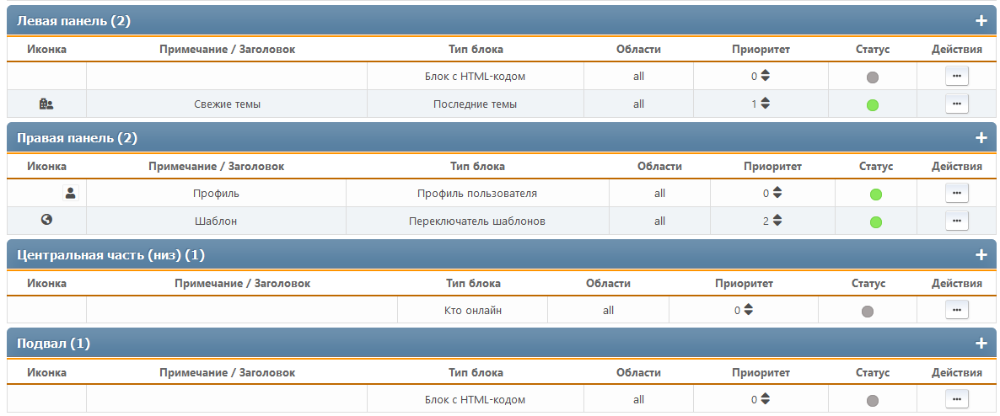

# Управление блоками
В этом разделе перечислены все настроенные блоки портала, как включенные, так и отключенные. Блоки отсортированы по панелям.

Для каждого блока отображаются его иконка, примечание или заголовок, тип, области вывода, приоритет и список действий.

Для каждой страницы доступны следующие действия:
* Изменение приоритета — внутри каждой панели можно настроить индивидуальный порядок блоков
* Переключение статуса (включена или отключена)
* Клонирование — создание нового блока, копирующего текущий
* Правка — изменение настроек конкретного блока
* Удаление