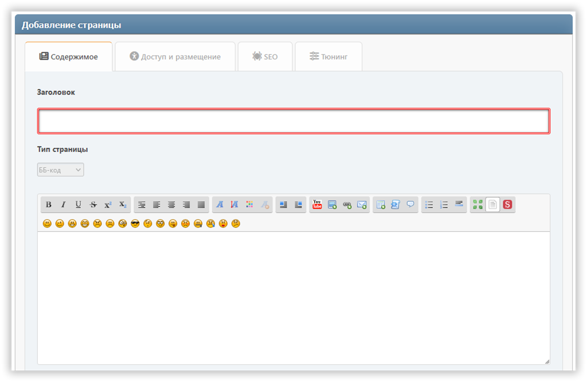

# Добавление страницы
В этом разделе можно создать страницу портала с нужным вам содержанием. Обязательные для заполнения поля подсвечиваются цветной рамочкой.

## Вкладка «Контент»
Здесь можно настроить:
* заголовок
* тип страницы
* содержание

## Вкладка «SEO»
Здесь можно настроить:
* алиас — страница будет доступна по адресу `?page=алиас`
* описание — meta description
* ключевые слова — meta keywords

## Вкладка «Тюнинг»
Здесь можно настроить:
* права доступа — укажите, кому будет доступна ваша страница
* рубрику — если вы любите всё упорядочивать по полочкам
* дату и время публикации — страница может быть опубликована по расписанию
* отображение заголовка — можно отключить, если у вас собственный заголовок на странице
* отображение автора и даты создания
* отображение похожих страниц
* комментарии — их можно разрешить или запретить отдельно для каждой страницы
