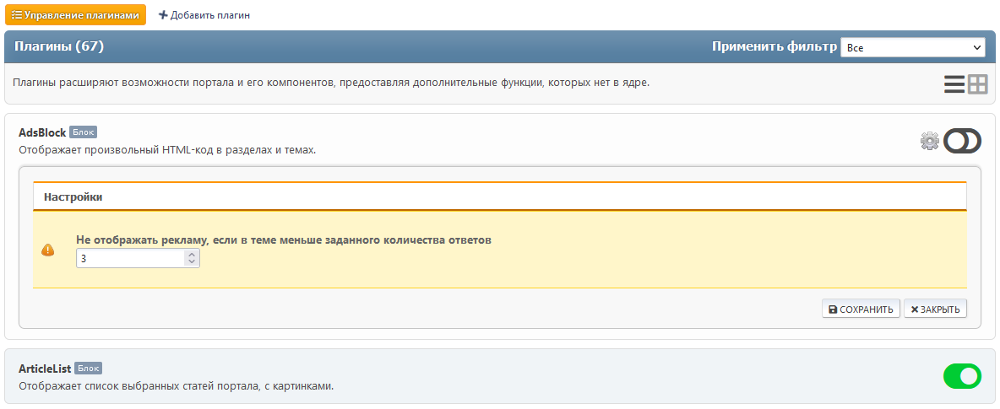
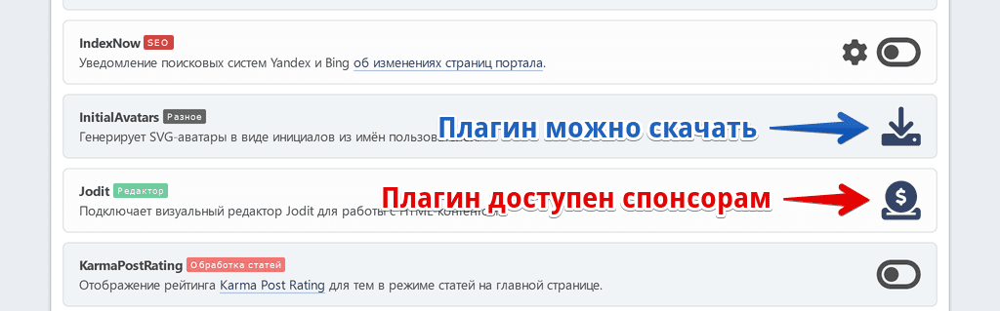

# Управление плагинами
Здесь перечислены все установленные плагины портала. Некоторые из них имеют свои настройки.

При желании можно переключаться между отображением плагинов в 1 колонку (по умолчанию) или в 2 колонки.

Для доступа к настройкам конкретного плагина нажмите на шестеренку рядом с кнопкой включения/отключения.

## Установка дополнительных плагинов
Некоторые плагины не входят в комплектацию портала, их нужно устанавливать отдельно. Такие плагины делятся на скачиваемые и бонусные, доступные спонсорам проекта.

Отдельный загружаемый плагин можно установить на странице [Импорт плагинов](/plugins/impex). Но можно и просто извлечь папку плагина из загруженного архива и переместить в директорию `Sources/LightPortal/Addons`.
